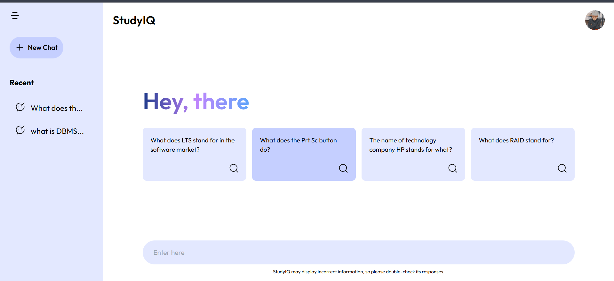
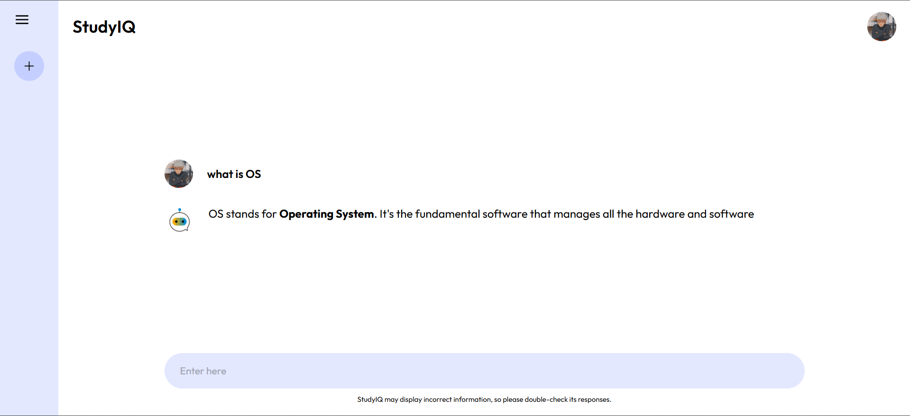

# StudyIQ

StudyIQ is an advanced chatbot application inspired by ChatGPT, designed to provide accurate, context-aware answers to user queries. This project combines modern web development technologies with powerful APIs to deliver a seamless user experience for learning, problem-solving, and knowledge exploration.

## 🚀 Features

- **Dynamic User Interface**: Built with **React.js** for an interactive and responsive experience.
- **Stylish and Responsive Design**: Styled using **Tailwind CSS**, ensuring a clean and responsive layout across all devices.
- **Intelligent Responses**: Powered by **Gemini API** and **OpenDB.com API** to provide accurate and reliable answers.
- **Search Functionality**: Users can ask diverse questions and receive contextually appropriate answers.
- **User-Friendly Interaction**: Simple and intuitive design for easy navigation and use.

## 💡 What I Learned

1. **React.js Development**: Creating and managing components, props, and state to build dynamic interfaces.
2. **API Integration**: Fetching and handling data from **Gemini API** and **OpenDB.com API** effectively.
3. **Tailwind CSS**: Utilizing utility-first CSS to design responsive and aesthetically pleasing user interfaces.
4. **Problem-Solving**: Enhancing logical thinking to structure efficient question-and-answer mechanisms.
5. **Project Management**: Planning and executing the project with a focus on user-centric features.

## 🛠️ Technologies Used

- **React.js**: For building the frontend components.
- **Tailwind CSS**: For styling and layout.
- **Gemini API**: To provide intelligent responses.
- **OpenDB.com API**: For accessing a wide range of reliable data.
- **JavaScript (ES6)**: For logic and functionality.

## 📂 Project Structure

```
StudyIQ/
├── node_modules/          # Installed dependencies
├── public/                # Static assets
├── src/
│   ├── assets/            # Media and images
│   ├── Components/        # React components
│   ├── Config/            # Configuration files
│   ├── Context/           # Context API for state management
│   ├── App.jsx            # Main application file
│   ├── main.jsx           # Entry point
│   └── index.css          # Global styles
├── .env                   # Environment variables
├── .gitignore             # Git ignored files
├── eslint.config.js       # ESLint configuration
├── index.html             # HTML template
├── package-lock.json      # Dependency lock file
├── package.json           # Project metadata and dependencies
├── postcss.config.js      # PostCSS configuration
├── tailwind.config.js     # Tailwind CSS configuration
├── vite.config.js         # Vite configuration
└── README.md              # Project documentation
```

## ⚙️ Installation and Setup

1. **Clone the Repository**
   ```bash
   git clone https://github.com/your-username/studyIQ.git
   ```

2. **Navigate to the Project Directory**
   ```bash
   cd studyIQ
   ```

3. **Install Dependencies**
   ```bash
   npm install
   ```

4. **Start the Development Server**
   ```bash
   npm start
   ```

5. Open your browser and navigate to `http://localhost:3000` to explore StudyIQ.

## 📸 Screenshots

### Home Page


### Chatbot in Action



---

Developed with ❤️ by **Angshu Das**.